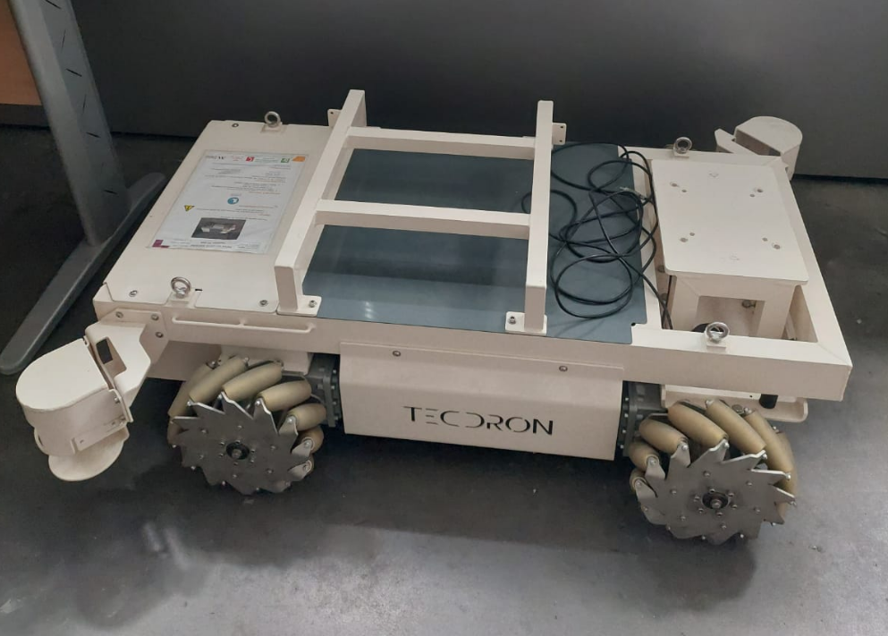
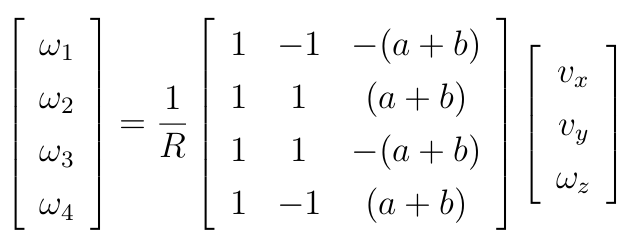
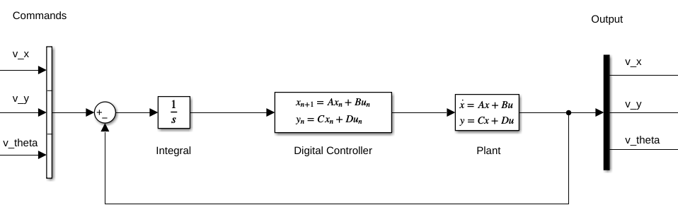

# Closed Loop Controller for the Tecdron: An Omnidirectional Mobile Base with 4 Wheels

This repository includes the simulations created for the synthesis and testing of the Tecdron, an omnidirectional mobile base with four Mecanum wheels.
The main goal was to develop a robust controller feasible for application using the ROS2 Control framework. It includes the Matlab simulations and the ROS2 environment for testing.

---
## Motivation

A holonomic base, like the Tecdron, can be highly useful in the industry due to its versatile movement capabilities. Consequently, reliable and robust simulations of these types of robots are necessary.
In parallel, ROS2 is increasingly present in the industry, and the main simulator used for ROS2 is Ignition Gazebo (as the classic version is being discontinued).

However, as far as I have observed, the simulations often use an open-loop approach to control the robot's movement, relying on inverse kinematics.

Although this method can be very useful as an initial step to get the robot working and moving in Gazebo—and it is even the method taught in this open class by The Construct (https://www.youtube.com/watch?v=px4AJ5VE-1U&t=1234s),it is not very precise, particularly in rotational movements, which often exhibit significantly different behavior. This imprecision can cause problems when testing algorithms like SLAM and Navigation. Consequently, the results from such simulations may not be sufficiently reliable.

That said, the main goal of this repository is to provide a simulated environment using ROS2 and Ignition Gazebo with robust controllers derived from Matlab simulations. The aim is to ensure that the commanded velocity closely matches, as precisely as control theory allows, the true velocity of the robot in the simulation.

---
### System Especifications
- Ubuntu 22.04
- Matlab 2024 with robust control toolbox
- ROS Humble
- Ign Gazebo

### System Requirements
- Docker Engine
- NVIDIA Container Toolkit

## Usage

To build the image just command:

    docker build -f dockerfile_nvidia_tecdron_humble -t tecdron_humble .

In order to visualize the gazebo simulation you need to allow non-network local connection to the control list

    xhost local:

Then, just bring in the simulation:

    docker-compose -f docker-compose.yml up

Depends on the branch you clone it will bring different simulations. 

Now you can interact with the simulation in another terminal:

    docker exec -it docker exec -it tecdron_humble_container /bin/bash

## Branchs

### Open_loop branch

In the open_loop branch, the system operates in an open loop, using forward controllers in the ROS2 Control framework. In this case, the wheel velocity commands are generated by the wheel_control_method.cpp file, located in the robot_description package, and the ROS2 Control framework simply transfers these values to the simulation.

### closed_loop_outside_ros2_control branch

While in the branch closed_loop_outside_ros2_control we have a half term. The closed loop is working properly but in a separate package named wheel_control and with the ss_control.cpp file. It will feed the forward controller present in the wheels with the proper wheel velocity. So in this step we are calculating the best wheel velocities from outside of the ros2_control framework.

To achieve proper results it's necessary a very reliable and robust odometry data. At this point the only goal is to control the velocities, so it's necessary the ground speeds of the vehicle. 

In real life some sensor fusion theory would be necessary. But we can cheat a little using a gazebo plugin that could give us these parameters from the engine. This will simplify our work. This plugin outputs the topic /true_odom, that is used in the control logic. 

### Main Branch

Finally, in the main branch we have the system running the controller The main modification was making this controller be able to subscribe to one more topic, in this case the /true_odom topic, which contains the data from the linear and angular speed of the base. And apply the logic inside the on_update method.

inside the ROS2 control framework. The model used as a reference, that saved most of the work for implementation, was present in this video of The Construct: https://www.youtube.com/watch?v=px4AJ5VE-1U&t=1234s.  

The main modification was making this controller be able to subscribe to one more topic, in this case the /true_odom topic, which contains the data from the linear and angular speed of the base. And apply the logic inside the on_update method. 

Here there is a little problem, the idea was letting this odometry topic configurable from a yaml file (in this case you can find it in the robot_description package named as mecanum_drive_controller.yaml), to simplify the use of this controller in different contexts. But for some reason, it always get an empty string from the yaml file in the parameter :

    filtered_odometry_topic: true_odom

I didn't undestand exactly the reason, but I plan to fix this soon. 

Unfortunately, for the moment if you want to change the topic you need to change inside the ros2_control package and build it. 

To see the results you can run the plotjunger inside the container. 
    
    ros2 run plotjuggler plotjugger

## Control System

The system requires a MIMO controller, Multiple Input Multiple Output.
So the strategy chosen was the robust control for H infinity norm. 
It can handle variations and a certain degree of incertanty in the
parameters and the result is a space state controller. 
The mathematical model and the controller synthesis can be found
in "Matlab Simulations/Controller". And the model can be tested
in a simplified version inside Simulink running the
 "Matlab Simulations/Model/RobustController_Test.slx".

Just a note, the controller had to be discretazed in order to work
properly in ros2, that's why you will see the tustin function 
applied into the controller. 

